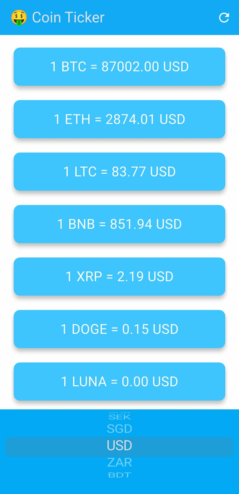

# Coin Ticker (bitcoin_ticker)

A lightweight Flutter app that displays live cryptocurrency prices with a clean, material-inspired UI. Designed for learning and quick demos — fetches rates for multiple coins and lets the user change the fiat currency.



## Key features

- Shows current price for popular cryptocurrencies (BTC, ETH, LTC, BNB, XRP, DOGE, LUNA).
- Select target fiat currency using a bottom picker.
- Refresh control to reload latest prices.
- Simple, accessible UI with large readable tiles.

## Screenshot

Place a screenshot at `assets/images/preview.png` (example attached in this repo). The preview above assumes that path.

## Requirements

- Flutter SDK (stable)
- Dart SDK (bundled with Flutter)
- Windows, macOS or Linux for development
- Internet connection to reach the price API

## Install & run (Windows)

1. Open a terminal (PowerShell or Windows Terminal) in the project folder:
   - Example path: `f:\Flutter app Project\bitcoin_ticker`
2. Get packages:
   ```powershell
   flutter pub get
   ```
3. Run on an attached device or emulator:
   ```powershell
   flutter run
   ```
4. Build release (optional):
   ```powershell
   flutter build apk   # Android
   flutter build ios   # iOS (macOS only)
   ```

## Configuration

- If the app requires an API key, create a config file or set an environment variable as documented in the code (search for `API_KEY`, `apiKey`, or `config` in the project).
- Add the screenshot to `assets/images/preview.png` and ensure `pubspec.yaml` includes the assets folder:
  ```yaml
  flutter:
    assets:
      - assets/images/preview.png
  ```

## Project structure (high level)

- lib/ — main app code
- assets/ — images and other static assets
- test/ — unit/widget tests
- pubspec.yaml — dependencies and asset configuration

## Contributing

- Fork the repository, create a feature branch, run tests, and submit a pull request.
- Keep changes small and focused. Include a short description of what you changed and why.

## Troubleshooting

- "Packages not found": run `flutter pub get`.
- "Device not detected": run `flutter devices` to list connected devices and emulators.
- Network data missing: check device network permissions and the API endpoint used by the app.

## License

MIT — see LICENSE file for details.

## Contact / Attribution

This repository was created as an educational/demo Flutter project. Replace this section with your contact or project URL as needed.
